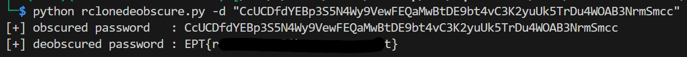

# Home Intrusion 2
*Author: PEDRO*

- Based off challenge 1, we understood that Peter got his files encrypted.
- Based off the challenge 2 handout, we get to understand that the files were exfiltrated.

This task then is about **unravelling the exfiltration details**.

Running [tree](tree.txt) to get a nice overview of all the files:
```bash
tree -f > tree.txt
```

Giving it to an LLM, it identifies that ```rclone.exe``` is present. Rclone is a well-known exfiltration tool.

It can be found thanks to:
- The file ```RCLONE.EXE-57223FB0.pf``` in the ```C:/Windows/prefetch``` folder. Prefetch files are here to speed up the loading of the main program.
- The file ```C\Users\Peter\AppData\Roaming\rclone\rclone.conf```, which is the standard path for Rclone configuration file.

```rclone.conf``` content:
```
[upload]
type = mega
user = werove6744@artvara.com
pass = CcUCDfdYEBp3S5N4Wy9VewFEQaMwBtDE9bt4vC3K2yuUk5TrDu4WOAB3NrmSmcc
```
The password seems to be encrypted in some way.

Reading [Rclone's documentation](https://rclone.org/commands/rclone_obscure/), one of the options is interesting:
> ```rclone obscure``` - Obscure password for use in the rclone.conf
>
> In the rclone config file, human-readable passwords are obscured. Obscuring them is done by encrypting them and writing them out in base64. 
> *This is not a secure way of encrypting these passwords* as *rclone can decrypt them* - it is to prevent "eyedropping" - namely someone seeing a password in the rclone config file by accident.

This means the clear-text password can be retrieved from the encrypted one.
Looking online, there is a tool whose sole purpose is to de-obscure Rclone passwords: https://github.com/maaaaz/rclonedeobscure

```bash
git clone https://github.com/maaaaz/rclonedeobscure.git
cd rclonedeobscure
pip install -r requirements.txt
python rclonedeobscure.py -d "CcUCDfdYEBp3S5N4Wy9VewFEQaMwBtDE9bt4vC3K2yuUk5TrDu4WOAB3NrmSmcc"
```
