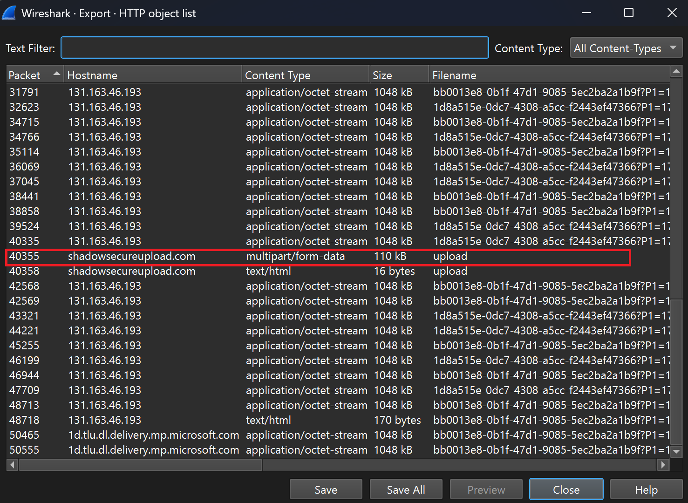
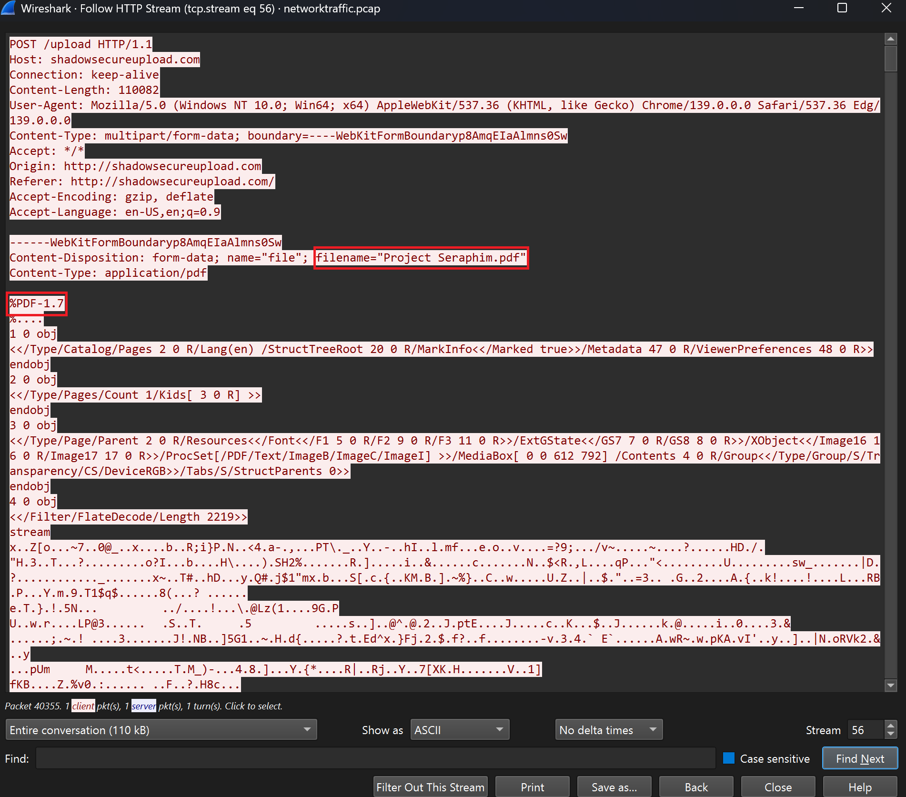
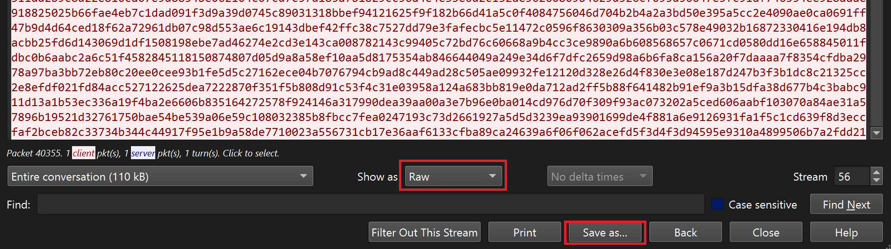
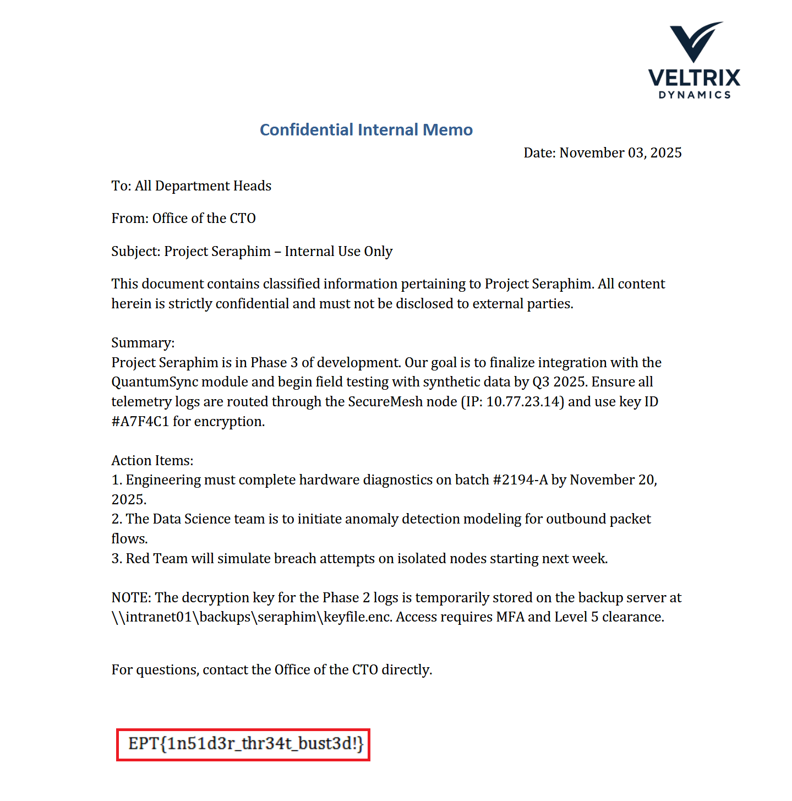

# Writeup: Insecure Exfil
## Team: Trånn Jånn
**Author:** Dragsund

---

Original challenge task:
> Whispers of corporate espionage have reached us. Someone claims Jason, one of our trusted employees, has been smuggling out company secrets. The only clue? A PCAP of suspicious network traffic. Dig in and find out what data left our walls.

---

I was tasked to find the data leak with the challenge's accompanied .pcap. I immediately went into wireshark's File -> Export Objects -> HTTP... to look for anything susipicious and saw a multipart/form-date upload to hxxp://shadowsecureupload[.]com. 

Upon following this HTTP stream I could see that it was a .pdf with the name: "Project Seraphim.pdf" which is highly suspicious.

I then converted the HTTP stream to raw and saved it as a .pdf for inspection

Upon opening I could see that this was an internal memo with the flag.

Flag: `EPT{1n51d3r_thr34t_bust3d!}`