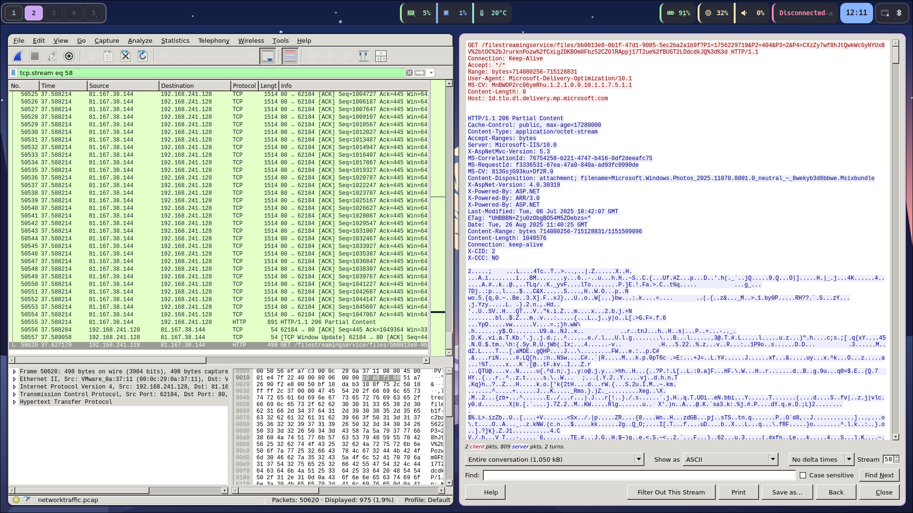
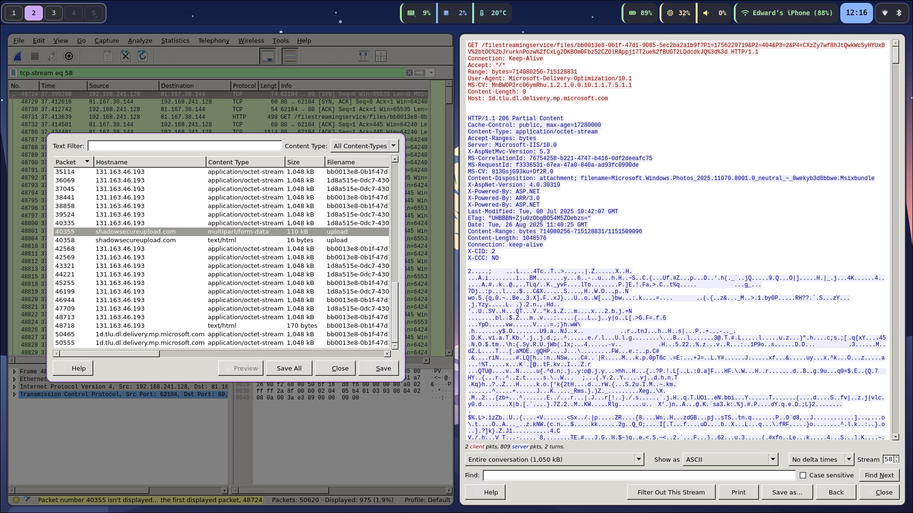
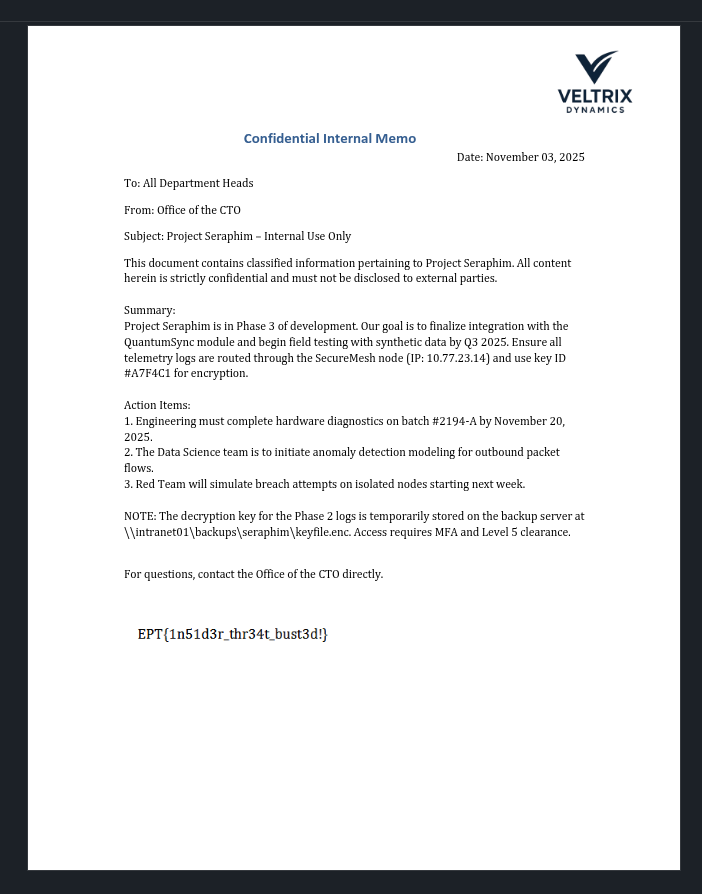

---
tags:
  - forensics
authors:
  - viipz
  - dino
---
## Challenge Description

```
Whispers of corporate espionage have reached us. Someone claims Jason, one of our trusted employees, has been smuggling out company secrets. The only clue? A PCAP of suspicious network traffic. Dig in and find out what data left our walls.
```

## Solution

After opening the provided PCAP file, I started examining the HTTP traffic. One particular request stood out a POST to `/filestreamingservice/files/...`, which suggested a possible file upload.




Using the **Export Objects → HTTP** feature in Wireshark, I found a file upload to `shadowsecureupload.com`. The domain name itself looked suspicious and matched the context of the challenge.




Inspecting the uploaded data revealed multipart form content, including a field that identified a file named **Project Seraphim.pdf**

```
------WebKitFormBoundaryp8AmqEIaAlmns0Sw
Content-Disposition: form-data; name="file"; filename="Project Seraphim.pdf"
Content-Type: application/pdf

%PDF-1.7
```

This confirmed that a PDF had been exfiltrated through the upload.
Using this script we can carve out the PDF from the multipart data

```python
input_file = "multipart_data.txt"
output_file = "Project_Seraphim.pdf"

with open(input_file, "rb") as f:
data = f.read()

start = data.find(b"%PDF-")
end = data.rfind(b"%%EOF")

if start != -1 and end != -1:
	pdf_data = data[start:end+5] # include %%EOF
	with open(output_file, "wb") as out:
		out.write(pdf_data)
	print(f"✅ Extracted PDF saved as: {output_file}")
else:
	print("❌ PDF markers not found.")
```

Running the script successfully produced the PDF. Opening the recovered **Project_Seraphim.pdf** revealed the final flag:



`EPT{1n51d3r_thr34t_bust3d!}`