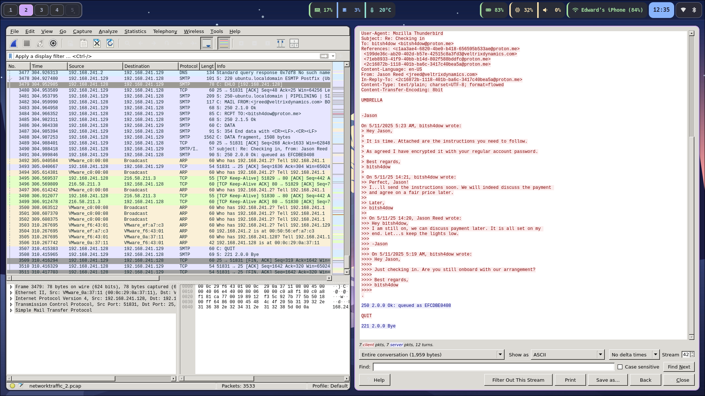
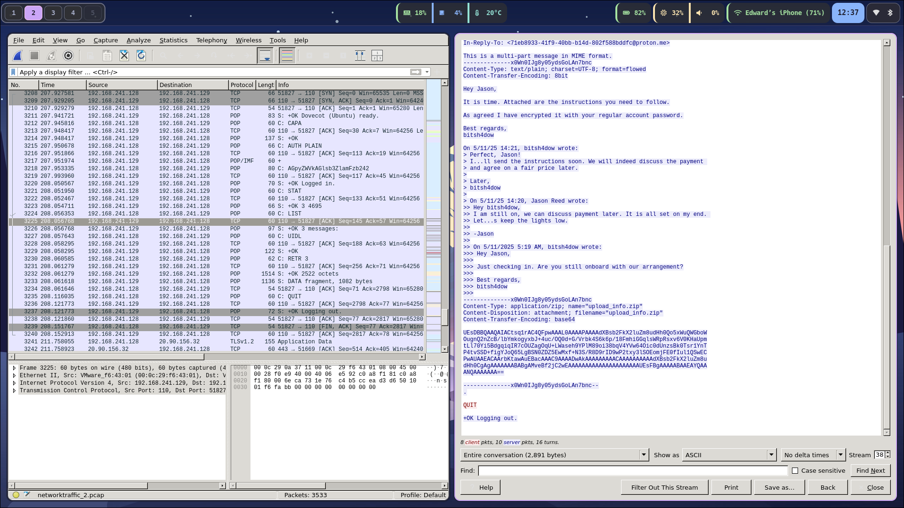
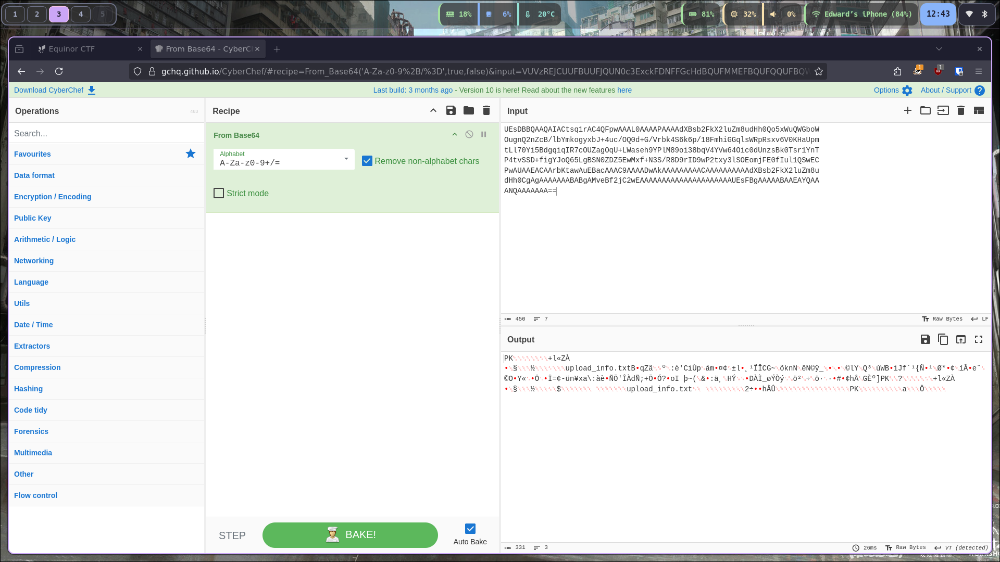
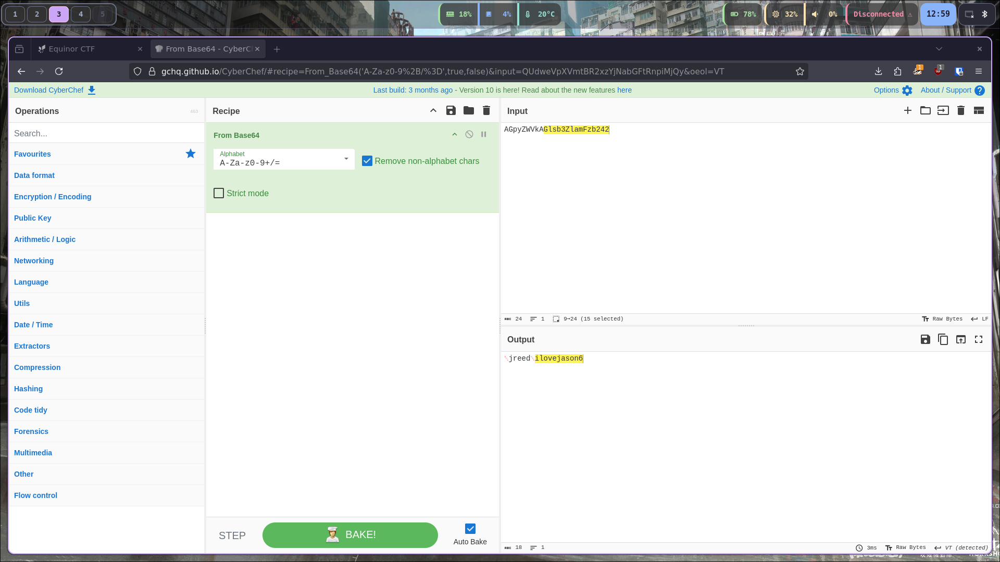
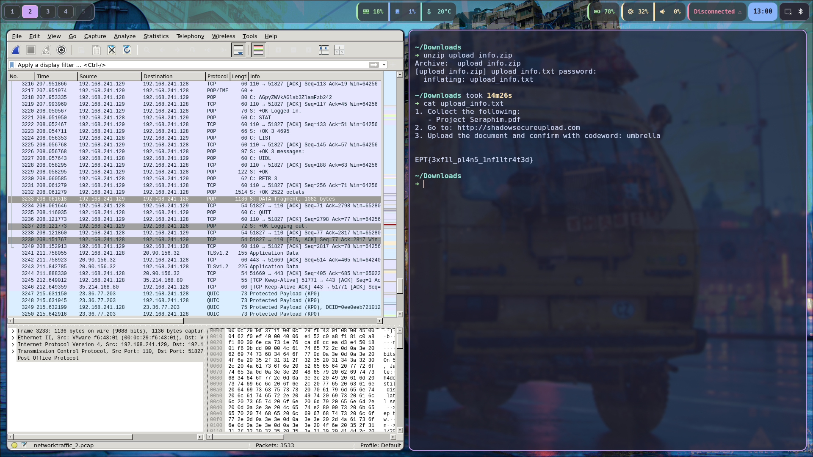

---
tags:
  - forensics
authors:
  - viipz
  - dino
---
## Challenge Description

```
The investigation continues. A new packet capture has surfaced, containing traces of the leak we've been tracking. Examine it closely and uncover how this operation was orchestrated.
```

## Solution

Opening the provided PCAP file, I started browsing through the captured traffic. Near the end, a TCP stream caught my eye. It looked like an email conversation.




One of the messages referenced an earlier email with _“attached instructions.”_ I scrolled up and found the original email that included a ZIP file said to be _“encrypted with your regular account password.”_ This looked promising.




The PCAP captured the full POP3 session, including the users login.

```
+OK Dovecot (Ubuntu) ready.

CAPA

+OK
CAPA
TOP
UIDL
RESP-CODES
PIPELINING
AUTH-RESP-CODE
USER
SASL PLAIN
.

AUTH PLAIN

+ 

AGpyZWVkAGlsb3ZlamFzb242

+OK Logged in.

STAT

+OK 3 4695

LIST

+OK 3 messages:
1 795
2 1378
3 2522
.

UIDL

+OK
1 0000000e68207d26
2 0000000f68207d26
3 0000001068207d26
.

RETR 3

+OK 2522 octets
Return-Path: <bitsh4dow@proton.me>
X-Original-To: jreed@veltrixdynamics.com
Delivered-To: jreed@veltrixdynamics.com
Received: from [192.168.241.129] (unknown [192.168.241.129])
	by ubuntu.localdomain (Postfix) with ESMTP id 33132E17C6
	for <jreed@veltrixdynamics.com>; Sun, 11 May 2025 14:23:00 +0200 (CEST)
Content-Type: multipart/mixed; boundary="------------x0Wn0IJg8y05ydsGoLAn7bnc"
Message-ID: <2c16872b-1118-401b-ba6c-3417c40bea5a@proton.me>
Date: Sun, 11 May 2025 14:23:00 +0200
MIME-Version: 1.0
User-Agent: Mozilla Thunderbird
Subject: Re: Checking in
From: bitsh4dow <bitsh4dow@proton.me>
To: Jason Reed <jreed@veltrixdynamics.com>
References: <c1aa3ae4-6820-4be0-b418-656595b533ae@proton.me>
 <199de36c-ab20-402d-b57e-42515c8a3fd3@veltrixdynamics.com>
 <71eb8933-41f9-40bb-b14d-802f588bddfc@proton.me>
Content-Language: en-US
In-Reply-To: <71eb8933-41f9-40bb-b14d-802f588bddfc@proton.me>

This is a multi-part message in MIME format.
--------------x0Wn0IJg8y05ydsGoLAn7bnc
Content-Type: text/plain; charset=UTF-8; format=flowed
Content-Transfer-Encoding: 8bit

Hey Jason,

It is time. Attached are the instructions you need to follow.

As agreed I have encrypted it with your regular account password.

Best regards,
bitsh4dow

On 5/11/25 14:21, bitsh4dow wrote:
> Perfect, Jason!
> I...ll send the instructions soon. We will indeed discuss the payment 
> and agree on a fair price later.
>
> Later,
> bitsh4dow
>
> On 5/11/25 14:20, Jason Reed wrote:
>> Hey bitsh4dow,
>> I am still on, we can discuss payment later. It is all set on my end. 
>> Let...s keep the lights low.
>>
>> -Jason
>>
>> On 5/11/2025 5:19 AM, bitsh4dow wrote:
>>> Hey Jason,
>>>
>>> Just checking in. Are you still onboard with our arrangement?
>>>
>>> Best regards,
>>> bitsh4dow
>>>
--------------x0Wn0IJg8y05ydsGoLAn7bnc
Content-Type: application/zip; name="upload_info.zip"
Content-Disposition: attachment; filename="upload_info.zip"
Content-Transfer-Encoding: base64

UEsDBBQAAQAIACtsq1rAC4QFpwAAAL0AAAAPAAAAdXBsb2FkX2luZm8udHh0Qo5xWuQWGboW
OugnQ2nZcB/lbYmkogyxbJ+4uc/OQ0d+G/Vrbk4S6k6p/18FmhiGGqlsWRpRsxv6V0KHaUpm
tLl70Yi5BdgqiqIR7cOUZagOqU+LWaseh9YPlM89oi38bqV4YVw64Oic0dUnzsBk0Tsr1YnT
P4tvSSD+figYJoQ65LgBSN0ZDZ5EwMxf+N3S/R8D9rID9wP2txy3lSOEomjFE0fIul1QSwEC
PwAUAAEACAArbKtawAuEBacAAAC9AAAADwAkAAAAAAAAACAAAAAAAAAAdXBsb2FkX2luZm8u
dHh0CgAgAAAAAAABABgAMveBf2jC2wEAAAAAAAAAAAAAAAAAAAAAUEsFBgAAAAABAAEAYQAA
ANQAAAAAAA==

--------------x0Wn0IJg8y05ydsGoLAn7bnc--
.

QUIT

+OK Logging out.
```

The attachment was base64 encoded. I copied the block into CyberChef, ran the **From Base64** recipe, and it produced a ZIP file.




Saving it as `upload_info.zip` and trying to extract it prompted for a password:

```
unzip upload_info.zip
Archive:  upload_info.zip
[upload_info.zip] upload_info.txt password: 
```


The email had already told us the password was _“your regular account password.”_ Using the POP3 session and CyberChef, I decoded it and decrypted the files.







The final flag was revealed:

`EPT{3xf1l_pl4n5_1nf1ltr4t3d}`