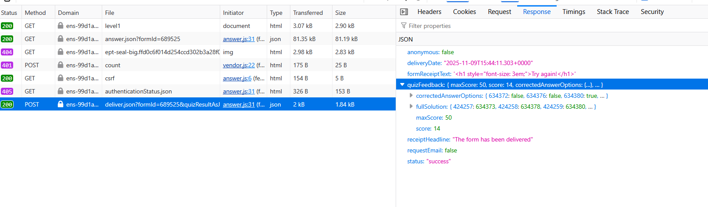
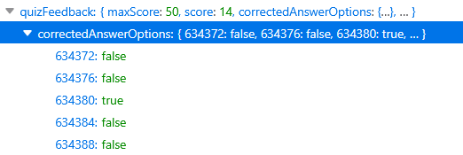
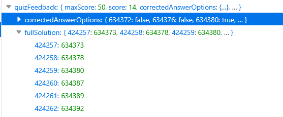
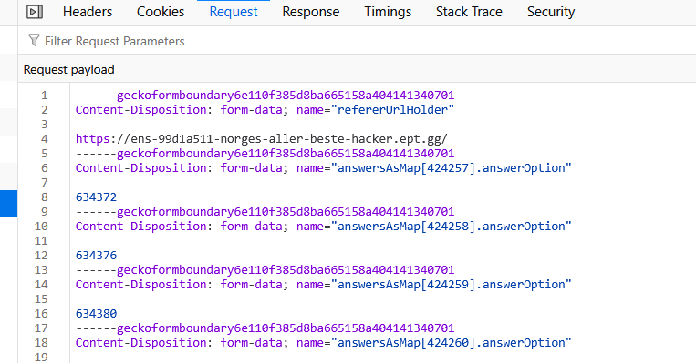
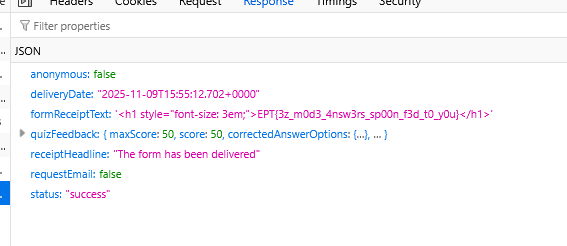

# Norges aller beste hacker - Level 1

    Welcome to the Norges Aller Beste Hacker qualifications!

    Our Level 1 quiz features cutting-edge cybersecurity scenarios like "What to do when your firewall starts meowing?" and "How to properly store SSH keys in your lunchbox?"

    Complete all questions correctly to earn your participation trophy (flag).

This task has no special category, so we don't know what to expect.

When we open the webpage for level 1 we see a form with 50 multiple choice questions. The questions and answers seemingly does not matter, so I select the first 50. I tried to do that with jquery in devtools, but couldn't get that to work, so I ended up just selecting them using my keyboard.

After submitting the form i get a reply saying 14 of 50 are correct. When looking at the network traffic from the browser we see an ajax call with the payload and a response

In the response there is a list with the status for each question true false

But there is also another list `fullSolution`

If we look at the request data we see that it's a multipart url encoded form.

 The IDs correspond to the list in `fullSolution`. I therefore just took the whole request payload and replaced my ID's with the correct ones. Then I used Firefox' excellent Edit and Resend feature to resend the form with correct answers.

Flag: `EPT{3z_m0d3_4nsw3rs_sp00n_f3d_t0_y0u}`

---
  
 <a href="https://enso.no" target="_blank">Made with ❤️ by Ensō</a>  
