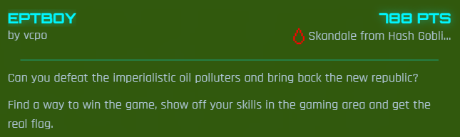
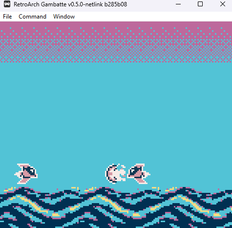
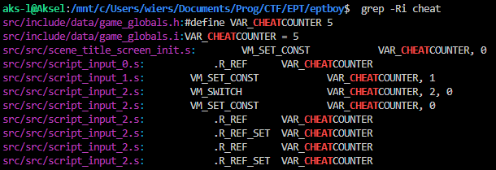
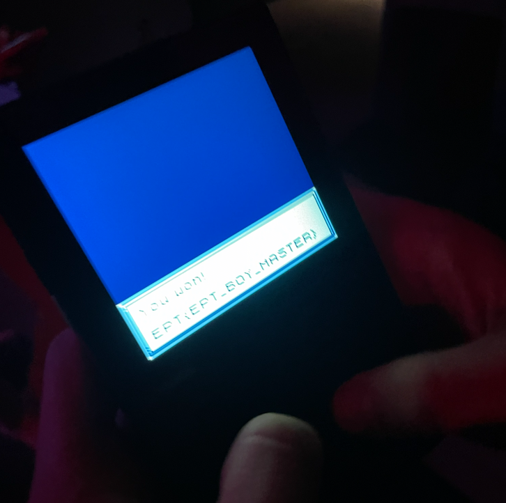

# EPTBOY

The challenge handout is the files for a gameboy game. Running `build.sh` makes the rom files, and the game can be loaded into an emulator.
Playing and completing the game is easy on the emulator, abusing frequent save states. The flag simply appears whenever the game is won, however the flag in the handout is a placeholder, and the real flag must be obtained on the onsite gameboys without save states, making it harder.
 
There must be some cheese in here, maybe a wrong warp or early trigger of the win screen. After searching for plausible keywords in the code, there is an obvoius clue, the `cheatcounter` variable.

The cheatcounter is being handled mostly by the `script_input_x.s` files. Each of these files are being called by an input from the hardware, as seen in `scene_title_screen_init.s`'s blocks that look like this:
```
        ; Input Script Attach
        VM_CONTEXT_PREPARE      1, ___bank_script_input_0, _script_input_0
        VM_INPUT_ATTACH         128, ^/(1 | .OVERRIDE_DEFAULT)/
```
Which maps [input 128 (START)](https://gbdk.org/docs/api/gb_8h.html) to script 0, and so on for all buttons.
SELECT sets cheatcounter to 1, and the other scripts has a switch like this:
```
        ; Switch Variable
        VM_SWITCH               VAR_CHEATCOUNTER, 2, 0
        .dw 1, 1$
        .dw 8, 2$
```
This switch for input B triggers when cheatcounter is 1 or 8, then increases it. For all other buttons as well, when it is clicked at the correct value of cheatcounter, it increases it by one, meaning there is a sequence of button clicking to increase cheatcounter to the correct value.
The script START is mapped to does this:
```
VM_RPN
  .R_REF VAR_CHEATCOUNTER
  .R_INT16 10
  .R_OPERATOR .EQ
VM_IF_CONST .NE, .ARG0, 0, 1$, 1
...
```
If cheatcounter equals 10...
```
1$:
    VM_SET_CONST VAR_INVINCIBLE, 1
...
```
Turn on invincible mode!

When starting the game in invinsible mode, it is impossible to lose!
Now after understanding code, the only thing needed is the correct "konami"-sequence.
The 10-button sequence ends up looknig like this:
SELECT → B → UP → DOWN → DOWN → A → LEFT → A → B → RIGHT
then START

After approximatley 30 seconds of not doing anything, the win screen with the flag appears

 

Flag: `EPT{EPT_BOY_MASTER}`