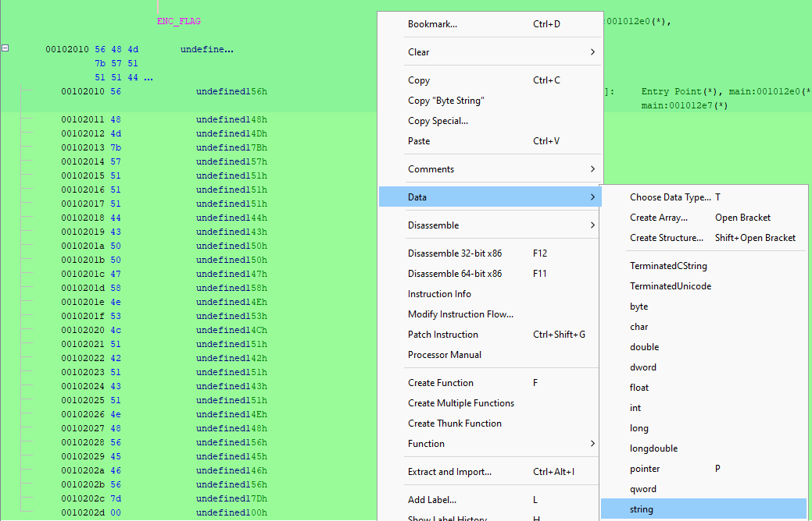

## Challenge Description
```
This one builds on FlagPrinter, but it's a new file!

Due to stricter security requirements, we can no longer print the flag (even with encryption). But we can check flags for you. Can you find the correct flag?
```

## Solution
Download the file and open it in Ghidra


### Main Function Analysis
In the main function we see the following code snippet:
```c
printf("Please enter your flag:\n> ");
__isoc99_scanf("%[^\n]s",&local_28);
sVar2 = strlen((char *)&local_28);
encode(&local_28,local_48,sVar2 & 0xffffffff);
iVar1 = strcmp(local_48,ENC_FLAG);
if (iVar1 == 0) {
  puts("CORRECT!");
}
else {
  puts("WRONG!");
}
return 0;
```

We can clean it up by replacing variable names to make it more readable:
```c
printf("Please enter your flag:\n> ");
__isoc99_scanf("%[^\n]s",&userInput);
userInput_len = strlen((char *)&userInput);
encode(&userInput, encodedOutput, userInput_len & 0xffffffff);
result = strcmp(encodedOutput, ENC_FLAG);
if (result == 0) {
  puts("CORRECT!");
}
else {
  puts("WRONG!");
}
return 0;
```

The program flow is:
1. Takes user input
2. Encodes the input using the `encode` function
3. Compares the encoded output with a hardcoded `ENC_FLAG` value
4. Prints "CORRECT!" if they match

### Encode Function Analysis
Looking into the `encode` function:
```c
void encode(long param_1, long param_2, int param_3)
{
  int iVar1;
  undefined4 i;
  
  for (i = 0; i < param_3; i = i + 1) {
    if ((*(char *)(param_1 + i) < 'A') || ('Z' < *(char *)(param_1 + i))) {
      *(undefined1 *)(param_2 + i) = *(undefined1 *)(param_1 + i);
    }
    else {
      iVar1 = i + *(char *)(param_1 + i) + -0x30;
      *(char *)(param_2 + i) = (char)iVar1 + (char)(iVar1 / 0x1a) * -0x1a + 'A';
    }
  }
  return;
}
```

After cleaning up and understanding the logic:
```c
void encode(char *input, char *output, int length)
{
  for (int i = 0; i < length; i++) {
    if ((input[i] < 'A') || (input[i] > 'Z')) {
      // Non-uppercase letters remain unchanged
      output[i] = input[i];
    }
    else {
      // For uppercase letters A-Z
      int shifted = i + input[i] - 0x30;  // -0x30 is -48
      output[i] = (shifted % 26) + 'A';
    }
  }
}
```

**Encoding Logic:**
- Non-uppercase letters (anything not A-Z) are copied unchanged
- For uppercase letters (A-Z):
  - Add the position index `i` to the character value
  - Subtract 48 (0x30)
  - Take modulo 26 to wrap around the alphabet
  - Add 'A' to convert back to a character

This is essentially a **position-dependent Caesar cipher** - each character is shifted by a different amount based on its position in the string.

### Finding ENC_FLAG



We set the data type to string, it then returns the following ENC_FLAG  
`VHM{WQQQDCPPGXNSLQBQCQNHVEFV}`

### Creating the Decoder
To reverse this encoding, we need to work backwards:
```python
def decode(encoded_text):
    decoded = []
    
    for position, char in enumerate(encoded_text):
        if not char.isupper():
            decoded.append(char)
            continue
        
        encoded_value = ord(char) - ord('A')  # Convert to 0-25 range
        
        for letter in 'ABCDEFGHIJKLMNOPQRSTUVWXYZ':
            test_encoding = (position + ord(letter) - 48) % 26
            if test_encoding == encoded_value:
                decoded.append(letter)
                break
    return ''.join(decoded)

ENC_FLAG = "VHM{WQQQDCPPGXNSLQBQCQNHVEFV}"
flag = decode(ENC_FLAG)
print(f"Flag: {flag}")
```

**Flag:** `EPT{BUTSECONDTIMEISGREATGOOD}`