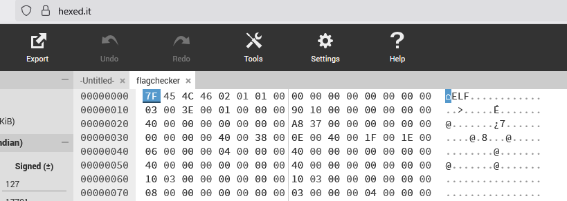
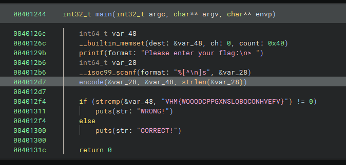

# Flagchecker

    This one builds on FlagPrinter, but it's a new file!

    Due to stricter security requirements, we can no longer print the flag (even with encryption). But we can check flags for you. Can you find the correct flag?

This exercise is similar to FlagPrinter. It's a straight forward reverse engineering challenge.

First things first: I open the downloaded binary in [Hexed.it](https://hexed.it) and see that it has the linux ELF header



So I open the binary in Binary Ninja, and it automatically opens both `main()` and `encode()` for me.




The `main()` function reads from the console, encodes the string using `encode()` and then compares it to the scrambled text `VHM{WQQQDCPPGXNSLQBQCQNHVEFV}`. If it is the same it prints "CORRECT!" and we know the flag. Now we just have to understand what `encode()` does and make a `decode()`.

Looking at the `main()` function we see that the first input parameter to encode() is the input string from the user, the second parameter is a reference parameter used to return the encoded string and the third parameter is the length of the string. We can convert the function to c# to make it more readable:
```c#
    public static string Encode(string input)
    {
        var output = new char[input.Length];
        for (var i = 0; i < input.Length; i++)
        {
            var c = input[i];
            if (c <= 0x40 || c > 0x5a)
                output[i] = c;
            else
                output[i] = (char)((i + (c - 0x41) + 0x11) % 0x1a + 0x41);
        }
        return new string(output);
    }
```

This function loops through each letter and first checks if it is lower than the hex value of the ascii character 'A' or higher than 'Z' it does nothing with the letter. Otherwise it adds 0x11(17) + i to the letter and does some other arithmetic to the letter. To me this looks almost like a Caesar Cipher, just that it also adds the index of the letter to the new value. So the first letter is shifted 17 slots up the alphabet, the next 18, then 19 and so on. The reason the code subtracts 0x41 from the letter is to handle overflows. If we operate on the range of number 0-25 instead of 65-90 we can use the mod (%) operator to handle situations when the letter is shifted past Z. This is useful to know when we create our decode function. 

The `decode()` function then must shift the first letter 17 slots down the alphabet, the second 18, then 19 etc. When subtracting we cannot use the mod operator because we might go past 0 so we can just as well stay in the 65-90 range. If we end up below 65, we just add 0x1a (26) to get into the ascii alphabet range again. Notice that the counter `i` might get large on long strings so we need to make sure that we don't subtract more than 25. To solve this we use the mod operator on i before subtracting.

```c#
    public static string Decode(string input)
    {
        var output = new char[input.Length];
        for (var i = 0; i < input.Length; i++)
        {
            var c = input[i];
            if (c <= 0x40 || c > 0x5a)
                output[i] = c;
            else
            {
                var newC = c - ((0x11+i)%0x1a);
                if(newC < 0x41)
                    newC += 0x1a;
                output[i] = (char)newC;
            }
        }
        return new string(output);
    }
```
Running this with the parameter `VHM{WQQQDCPPGXNSLQBQCQNHVEFV}` gives us `EPT{BUTSECONDTIMEISGREATGOOD}`

There might be a way to solve this exercise quickly by using CyberChef or dcode.fr but I didn't investigate that.

## References
- [Binary ninja](https://binary.ninja/)
- [Caesar Cipher](https://en.wikipedia.org/wiki/Caesar_cipher)
- [CyberChef](https://cyberchef.io)
- [dcode](https://dcode.fr)

---
  <center> <a href="https://enso.no" target="_blank">Made with ❤️ by Ensō</a>  </center>