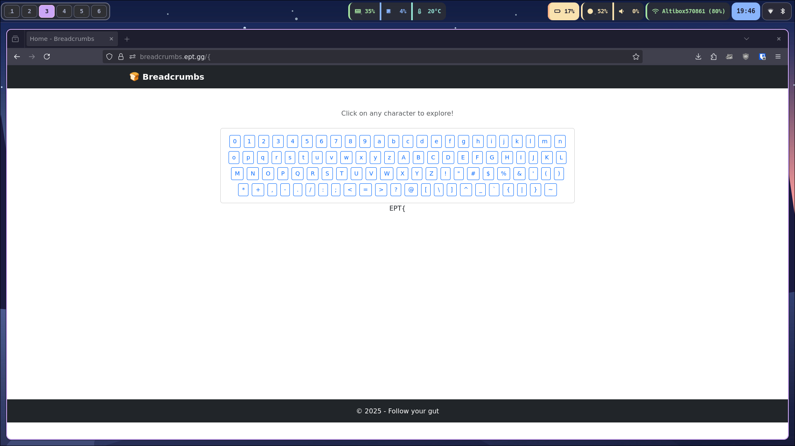

## Challenge description
```
Follow the breadcrumbs to find the flag!
```

## Solution
After opening the site and clicking around for a bit, I noticed that clicking the letter **E** caused it to be displayed on the page. That suggested the flag is entered one character at a time, but any incorrect click resets the sequence.




To automate the process I wrote a script to visit the character URLs in sequence and brute-force the flag by testing each next character.

```python
import requests
from bs4 import BeautifulSoup

BASE_URL = "https://breadcrumbs.ept.gg"

session = requests.Session()

current_sequence = "EPT{"

char_to_url = {
    '-': f"{BASE_URL}/-", '}': f"{BASE_URL}/%7D",
    '0': f"{BASE_URL}/0", '1': f"{BASE_URL}/1", '2': f"{BASE_URL}/2", '3': f"{BASE_URL}/3", '4': f"{BASE_URL}/4",
    '5': f"{BASE_URL}/5", '6': f"{BASE_URL}/6", '7': f"{BASE_URL}/7", '8': f"{BASE_URL}/8", '9': f"{BASE_URL}/9",
    'a': f"{BASE_URL}/a", 'b': f"{BASE_URL}/b", 'c': f"{BASE_URL}/c", 'd': f"{BASE_URL}/d", 'e': f"{BASE_URL}/e",
    'f': f"{BASE_URL}/f", 'g': f"{BASE_URL}/g", 'h': f"{BASE_URL}/h", 'i': f"{BASE_URL}/i", 'j': f"{BASE_URL}/j",
    'k': f"{BASE_URL}/k", 'l': f"{BASE_URL}/l", 'm': f"{BASE_URL}/m", 'n': f"{BASE_URL}/n", 'o': f"{BASE_URL}/o",
    'p': f"{BASE_URL}/p", 'q': f"{BASE_URL}/q", 'r': f"{BASE_URL}/r", 's': f"{BASE_URL}/s", 't': f"{BASE_URL}/t",
    'u': f"{BASE_URL}/u", 'v': f"{BASE_URL}/v", 'w': f"{BASE_URL}/w", 'x': f"{BASE_URL}/x", 'y': f"{BASE_URL}/y",
    'z': f"{BASE_URL}/z", 'A': f"{BASE_URL}/A", 'B': f"{BASE_URL}/B", 'C': f"{BASE_URL}/C", 'D': f"{BASE_URL}/D",
    'E': f"{BASE_URL}/E", 'F': f"{BASE_URL}/F", 'G': f"{BASE_URL}/G", 'H': f"{BASE_URL}/H", 'I': f"{BASE_URL}/I",
    'J': f"{BASE_URL}/J", 'K': f"{BASE_URL}/K", 'L': f"{BASE_URL}/L", 'M': f"{BASE_URL}/M", 'N': f"{BASE_URL}/N",
    'O': f"{BASE_URL}/O", 'P': f"{BASE_URL}/P", 'Q': f"{BASE_URL}/Q", 'R': f"{BASE_URL}/R", 'S': f"{BASE_URL}/S",
    'T': f"{BASE_URL}/T", 'U': f"{BASE_URL}/U", 'V': f"{BASE_URL}/V", 'W': f"{BASE_URL}/W", 'X': f"{BASE_URL}/X",
    'Y': f"{BASE_URL}/Y", 'Z': f"{BASE_URL}/Z", '!': f"{BASE_URL}/%21", '"': f"{BASE_URL}/%22", '#': f"{BASE_URL}/%23",
    '$': f"{BASE_URL}/%24", '%': f"{BASE_URL}/%25", '&': f"{BASE_URL}/%26", "'": f"{BASE_URL}/%27", '(': f"{BASE_URL}/%28",
    ')': f"{BASE_URL}/%29", '*': f"{BASE_URL}/%2A", '+': f"{BASE_URL}/%2B", ',': f"{BASE_URL}/%2C",
    '.': f"{BASE_URL}/.", '/': f"{BASE_URL}//", ':': f"{BASE_URL}/%3A", ';': f"{BASE_URL}/%3B", '<': f"{BASE_URL}/%3C",
    '=': f"{BASE_URL}/%3D", '>': f"{BASE_URL}/%3E", '?': f"{BASE_URL}/%3F", '@': f"{BASE_URL}/%40", '[': f"{BASE_URL}/%5B",
    '\\': f"{BASE_URL}/%5C", ']': f"{BASE_URL}/%5D", '^': f"{BASE_URL}/%5E", '_': f"{BASE_URL}/_", '`': f"{BASE_URL}/%60",
    '{': f"{BASE_URL}/%7B", '|': f"{BASE_URL}/%7C", '~': f"{BASE_URL}/~"
}


def extract_text_from_location(html_content):
    """Extract text from the same location where 'EPT' appears in the example."""
    soup = BeautifulSoup(html_content, 'html.parser')

    text_center_divs = soup.find_all('div', class_='text-center')

    for div in text_center_divs:
        text = div.get_text().strip()
        if text and len(text) < 50 and not text.startswith('©'):
            return text

    return None


def make_request(url):
    """Make a request to the specified URL using the global session."""
    try:
        print(f"Requesting {url}...", end=' ')

        response = session.get(url, timeout=10)
        response.raise_for_status()

        extracted_text = extract_text_from_location(response.text)

        if extracted_text:
            print(f"✓ Found: '{extracted_text}'")
            return extracted_text
        else:
            print("✗ No text found")
            return None

    except requests.exceptions.RequestException as e:
        print(f"✗ Error: {e}")
        return None
    except Exception as e:
        print(f"✗ Unexpected error: {e}")
        return None


def establish_sequence(sequence):
    """Establish a sequence by visiting each character in order."""
    print(f"Establishing sequence: '{sequence}'")
    for i, char in enumerate(sequence):
        if char not in char_to_url:
            print(f"Character '{char}' not available in mapping!")
            return False

        url = char_to_url[char]
        print(f"  [{i+1:2d}/{len(sequence)}] Visiting '{char}': ", end='')
        result = make_request(url)

        expected = sequence[:i+1]
        if not result or result != expected:
            print(f"✗ Expected: '{expected}', Got: '{result}'")
            return False
        else:
            print(f"✓ '{result}'")

    return True


def bruteforce_next_char(sequence):
    """Bruteforce the next character after the given sequence."""
    print(f"Bruteforcing next character after: '{sequence}'")
    print("=" * 60)

    all_chars = list(char_to_url.keys())

    for char in all_chars:
        print(f"\nTrying next character: '{char}'")

        # Re-establish the sequence for each attempt
        test_sequence = sequence + char

        if establish_sequence(test_sequence):
            print(f"✓ SUCCESS! Found valid character: '{char}'")
            print(f"  Complete sequence: '{test_sequence}'")
            print("=" * 60)

            print(f"Found valid sequence: '{test_sequence}'")
            return char, test_sequence
        else:
            print(f"✗ Character '{char}' is not valid")

    print("=" * 60)
    print("No valid next characters found")
    return None, sequence


def bruteforce(starting_sequence=None):
    if starting_sequence is None:
        starting_sequence = current_sequence

    current_seq = starting_sequence
    print(f"Starting continuous bruteforce from: '{current_seq}'")
    print("Automatically continuing until '}' is found...")
    print("=" * 80)

    while True:
        found_char, current_seq = bruteforce_next_char(current_seq)
        if found_char:
            print(f"\n🎉 Found character: '{found_char}'")
            print(f"Current sequence: '{current_seq}'")

            if found_char == '}':
                print("\n🏆 SUCCESS! Found closing brace '}' - Flag complete!")
                print(f"🚩 Final flag: '{current_seq}'")
                break
            else:
                print("Continuing automatically...")
        else:
            print("🏁 No more characters found. Bruteforce stopped!")
            print(f"Current sequence: '{current_seq}'")
            break


if __name__ == "__main__":
    bruteforce()

```


Running the script revealed the full flag:

`🚩 Flag: 'EPT{2a65f323-6df3-a713-bc1a-e80afb6ca9fd}'`
